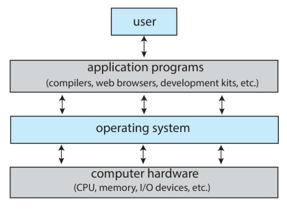

# IT108 Notes - Chapter 1
by Jeremy Andrews Zantua

**Summary**
- [Definition of a computer](#definitionOfAComputer)
  - [Computer System Structure](#computerSystemStructure)
- [Operating System](#os)
  - [OS Levels](#osLevels)
- [Computer System Organization](#computerSystemOrganization)

## Definition of a Computer
A computer is an electromechanical device that takes input, processes it and produces an output
### Computer System Structure
The structure of a computer system can be divided roughly into four components:
- **Hardware** provides basic computing resources such as: CPU, memory, I/O devices.
- **Operating System** controls and coordinates the use of hardware among various applications and users.
- **Application Programs** define the ways in which the system resources are used to solve the computing problems of the users. Word processors, compilers, web browsers, database systems and video games fall under this category.
- **User** refers to the people using the computer, or machines and other computers interfaced and interacting with a computer.

A few types of the most common computers are Desktop and laptops and mobile devices.
**Hardware** provides basic computing resources for the system. This includes CPU, memory, IO devices, etc.

A visual representation of the abstraction of a computer system structure can be depicted like this:

## Operating System
The term **Operating System** covers many roles due to the myriad of designs and uses for operating systems. They can be found not only in desktop, laptop or mobile computers - but also in household appliances, transportation, industrial control systems, to name a few.

- An operating system provides an environment for the execution of programs by providing services to users and programs.
- It acts as an intermediary between a user of a computer and the computer hardware.
- Its goals are to execute user programs, make the computer system easy to use, and to utilize the hardware efficiently.
- Runs on the same processr as the user's program code
- Does not include applications
- It is also both a resoruce allocator - which decides between conflicting requests for efficient and fair resource use, as well as being a Control Program that controls the execution of programs to prevent errors and improper use of computer.
- Manages system's resources
  - Allocation of resources
  - Decide which programs can run and when
  - Stop and restart running programs, preemption
  - Time Sharing

There are three primary approaches for **interacting with an operating system** are:
- Command interpreters
- Graphical User Interfaces
- Touchscreen interfaces

In a modern OS:
- Many programs can be loaded, all at the same time.
- The same program could be loaded multiple times.

### OS Levels
**HARDWARE**
1. Electronic Circuits
2. Processor Instruction Set
3. Procedures
4. Interrupts

**KERNEL**
5. Primitive Processes
6. Secondary Storage
7. Virtual Memory

**OTHER OS**
8. Communications
9. File Systems
10. Devices
11. Directories
12. User Processes
13. Shell

## Computer System Organization
- The operation of a computer system utilizes
  - One or more CPUs and device controllers connect through a **common bus**, providing access to shared memory.
  - The concurrent execution of CPUs and devices compete for memory cycles.

## Computer-System Operation
- I/O devices and the CPU can execute concurrently.
- Each device controller is in charge of a particular device type. See more at **Device Controllers**.
- Each device controller has a local buffer.
- Each device controller type has an operating system device driver to manage it
- CPU moves data from/to main memory to/from local buffers.
- I/O is from the device to local buffer of controller.
- Device controller informs CPU that it has finished its operation by causing an interrupt.
